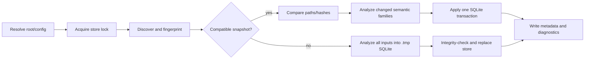

# RimContext static-analysis module architecture

Status: implemented first release (`0.1.0`, schema `rimctx/v1`). RimContext is an internal
RimLiaison module with a typed Core API, a direct drill-down CLI, and its own tests; this document
describes the module and its deliberate v1 limits.

## Purpose and boundaries

RimContext is a deterministic, local index and query CLI for RimWorld mod development. It
precomputes source, XML, Harmony, assembly, mod, project, and dependency facts so an agent can
identify what to inspect without repeatedly opening files or launching RimWorld.

RimContext owns:

- workspace discovery, normalized paths, fingerprints, incremental invalidation, and persisted index
  metadata;
- static C# (Roslyn), XML, managed assembly metadata, project, and `About/About.xml` analysis;
- stable entity IDs and deterministic relationships for definitions, symbols, patches, and dependencies;
- bounded `find`, `refs`, `definition`, `affected`, `harmony`, `file`, and `summary` queries;
- compact JSON, human-readable JSON, concise errors, and stderr diagnostics.

RimContext does not own runtime game control, process lifecycle, readiness, save/debug automation, test
execution, build orchestration, deployment, assembly loading, package restore, MSBuild execution,
network access, UI automation, or live IPC. DevBridge2 remains the lifecycle/test authority and
RimBridgeServer remains the live-game observation/control authority. RimContext has no dependency on
either project and does not launch RimWorld.

RimLiaison uses `RimContext.Core` in-process for normal affected selection. The typed Core API
returns bounded domain results directly, so the normal path does not spawn `rimctx` or serialize a
temporary JSON handoff. The direct `rimctx` executable remains a narrow drill-down/debugging
surface over that same Core API and retains the versioned `rimctx/v1` contract.

## Content Intelligence

RimContext owns the compact `content-blueprint/v1` and `content-evidence/v1` contracts plus
deterministic Phase 2 structural analysis. RimLiaison captures them automatically for content runs
when the agent supplies `--content-kind` and/or `--content-role`; indexed file/entity/dependency and
source-identity facts are derived from the selected RimContext index. Evidence is never merged into
intent and is ignored when its source identity is stale.

Structural fingerprints cluster shape before semantic reuse. Versioned qualification criteria require
independent successful implementations, fresh evidence, applicable validation, and bounded repair
rates. Qualified candidates undergo historical replay before automatic promotion to data-only
`content-archetype/v1` records containing templates, defaults, constraints, validation expectations,
and supporting IDs; no executable generator or opaque confidence score is stored.

Shared precedents use the canonical workspace `.rimdev/content-intelligence.jsonl` by default. The
append-only store keeps structured metadata, stable source/entity references, evidence, archetype
versions, usage evidence, quarantine state, and project-scoped exclusion/constraint policies; it
never copies source bodies. `rimliaison content query` and `rimctx content` provide bounded ranked
references. Trust ordering and fallback are explicit:
`RimContent proven archetype -> proven RimContext precedent -> vanilla/reference pattern -> novel`.


RimLiaison projects this lifecycle into the existing observability store as canonical `content.*`
events. The desktop Content Intelligence section is an incremental, bounded projection: it keeps
blueprint/detail history, precedent and archetype history, regressions, reuse distribution, and
measured efficiency separate from the validation owner. `logicalAgentId` joins sessions across
runs without collapsing run/session drill-down. Exact elapsed/token fields are nullable and are
never inferred. Scoped quarantine, rollback, project exclusion, and source-ineligibility writes
use the Core administration API and append an audit event; they are not approval gates.
## Context Bundle foundation

`rimctx-bundle/v1` is the cross-stack context snapshot consumed by agents and diagnostics. It is
available through `rimliaison context --json` (the maintained aggregator) and `rimctx context --json`
(the direct Core surface). The bundle has explicit topology, repository, environment, deployment,
runtime, testing, execution, failure, efficiency, decision, and extension fields. Each core section
has an availability/freshness status, so an absent lower-layer answer remains `unknown` or
`unavailable` instead of being guessed.

RimContext owns aggregation and static facts, while Git, RimTest/RimLiaison, DevBridge2,
RimBridgeServer, and RimError retain their existing authority for repository, selection, deployment,
runtime, and failure state. RimLiaison's provider reads those owner surfaces and the canonical
observability store; it does not create a second state database. `context` is read-only, does not
launch RimWorld, and never writes generated state into the repository. See
[docs/context-bundle.md](context-bundle.md) for the schema, provenance, provider, and compatibility
contract.

The maintained provider also projects the latest structured affected-selection and suite-completion
events: selected/executed/reused/skipped suites and tests, evidence/cache invalidation, transaction
and generation identity, fingerprints, bounded durations, and infrastructure/test failure taxonomy.
DevBridge2 state comes from read-only `doctor --json` plus `agent snapshot --json`; absent or stale
runtime identity remains explicit. The compact `agentSummary` is derived from those sections, while
the full canonical arrays remain available for diagnostics. Repository-local generated state is
audited separately from meaningful `.rimdev/stack.json` configuration; unclassified transaction,
report, cache, temp, or diagnostic paths are surfaced for owner review rather than blindly ignored.

DevBridge's `runtimeIdentity` projection is the authoritative identity record for live gates. It
keeps the source checkout, installed `Mods\DevBridge2` runtime, optional pinned worktree, RimWorld
root, and executable distinct. The provider preserves that bounded projection in
`runtime.runtimeIdentity`; it never derives a game executable from the current directory or
repository path. Source-only build, sync, and context operations remain usable when the live
identity is unavailable, which is reported as `unknown` or `unavailable` with the owner error code
and next action.

## Runtime, layout, and entrypoint

The consolidated solution targets `net8.0`; the root `global.json` pins SDK `8.0.424` with
roll-forward disabled. `src/RimLiaison.Cli` references `RimContext.Core` directly. The separate
`src/RimContext.Cli/Program.cs` delegates to `CliApplication`, whose executable name is `rimctx`,
for direct drill-down callers and CLI contract tests.
The source-tree Windows wrapper `rimctx.cmd` runs the Release executable, falls back to Debug, and
prints a build instruction if neither exists. Build with:

```text
dotnet build RimLiaison.sln --configuration Release
```

The runtime dependencies are deliberately small and pinned by the project files: Roslyn C# 4.11,
Microsoft.Data.Sqlite 8.0.8, and System.Reflection.Metadata 8.0.0. No indexed assembly is loaded into
the RimContext process.

The module's layout inside RimLiaison is:

```text
RimLiaison/
  global.json                 # canonical repository SDK configuration
  RimLiaison.sln              # all internal projects
  Directory.Build.props       # canonical repository build configuration
  rimctx.cmd                   # direct RimContext drill-down wrapper
  rimliaison.cmd               # canonical orchestration wrapper
  src/RimLiaison.Cli/          # orchestration frontend
  src/RimError.*               # diagnostic module and direct drill-down CLI
  src/RimContext.Core/
    Configuration/ Discovery/ Logging/ Model/ Output/ Semantics/ Storage/
  src/RimContext.Cli/
    Program.cs CliApplication.cs CliParser.cs CliRequest.cs
  tests/RimContext.Tests/
    Program.cs
  tests/Fixtures/RealisticMod/
  docs/architecture.md
  docs/agent-usage.md
```

## Direct CLI contract

The following commands are the direct RimContext drill-down surface. The normal agent-facing
entrypoint is `rimliaison affected --run --json`, which uses the Core API in-process before it
coordinates external DevBridge2 work.

The implemented commands are:

```text
rimctx index
rimctx find QUERY
rimctx refs ENTITY
rimctx definition ENTITY_OR_NAME
rimctx affected PATH [PATH ...]
rimctx harmony [TARGET] [--file PATH]
rimctx file PATH_OR_ID
rimctx summary
rimctx version
rimctx context
rimctx content [QUERY]
```

Common options are `--root`, `--store`, `--assembly-root` (repeatable for indexing), `--force`,
`--json`, `--compact`, `--human`, `--limit`, and `--max-bytes`; `context` also accepts `--verbose`;
`content` accepts `--kind`, `--role`, and `--include-failures`. `refs` accepts `--direction in|out|both`;
`affected` accepts `--depth 1..8`; `find` accepts `--kind`. The parser defaults to compact agent
output. `--json` is accepted for explicit agent command lines; output is JSON for every command.

The default store is `<root>/.rimctx/index.sqlite`. A custom store must not be inside the indexed
root except under `.rimctx`. Paths are canonicalized before discovery and displayed relative to the
workspace with `/` separators. External assembly roots use deterministic `external/<root-key>/...`
display paths.

All successful commands write one JSON object and a newline to stdout. Logging and unexpected
exception diagnostics go to stderr. Queries never scan, build, launch the game, or repair an index.

## Unified production distribution

Production is one immutable product: the promoted RimLiaison CLI and assembly, the packaged
transaction consumer, and the qualified DevBridge runtime identity are bound by one product
fingerprint. The production manifest contains only staged package paths and hashes; source
checkout paths are qualification inputs, never runtime inputs. The package manifest records the
same component inventory and compatibility contract.

The pre-consolidation execution boundary was:

```text
agent -> RimLiaison -> DevBridge command -> source transaction consumer
       -> DevBridge Coordinator -> RimWorld
```

The consolidated boundary is:

```text
agent -> RimLiaison production package
       -> packaged transaction consumer + installed qualified DevBridge runtime
       -> DevBridge Coordinator -> RimWorld
```

Agents see one autonomous command and one normalized outcome. RimLiaison owns production
identity binding, transaction invocation, bounded recovery coordination, result projection, and
cleanup. DevBridge remains the authority for lifecycle, descriptor validation, build/deploy,
generations, leases, and loaded-artifact evidence; RimBridgeServer remains the live-game owner.
The agent does not select a source checkout consumer, invoke Coordinator subcommands, or manage
routine leases.

## Affected-run prerequisite ownership

Tooling-owned runtime prerequisites should be recovered by Tooling when recovery is safe and
deterministic. `RimLiaison` is the canonical recovery owner for the normal
`rimliaison affected --run --json` transaction; `RimContext.Core` remains the index owner and
DevBridge2 remains the lifecycle, descriptor-validation, deployment, and lease owner. RimLiaison
does not launch RimWorld or replace DevBridge2's authoritative checks.

Before the freshness anchor runs, RimLiaison reconciles a missing, malformed, or stale
`DevelopmentProjects/<project>.json` only when the repository/catalog metadata identifies one
project file, recipe, and deployment target. Existing valid descriptors are reused. Replacements
are written atomically and stale files are retained as bounded recovery backups. Ambiguous source,
recipe, or deployment metadata remains an explicit `RECOVERY_REQUIRED` blocker.

If the in-process affected query returns a partial index, RimLiaison asks the canonical Core
service for one forced rebuild and retries the affected query once. A second partial result keeps
the bounded index diagnostics and reports `RIMCONTEXT_INDEX_RECOVERY_FAILED`.

For `RIMBRIDGE_LEASE_REQUIRED`, RimLiaison first reuses the compatible lease already held by a
supported suite transaction. Without one, it makes one canonical lease acquisition attempt,
passes that lease to the blocked owner/recipe operation, retries once, and releases it in a
`finally` path. Active ownership is never stolen; contention is reported as `contended`. Recovery
events use structured states `ready`, `recovered`, `recoveryRequired`, `contended`, `unavailable`,
or `recoveryFailed`, with bounded attempt counts and an action field where applicable.

## Canonical affected-run orchestration contract

`rimliaison affected --run --json` is the autonomous validation boundary. An agent invoking it
does not need to create DevBridge development descriptors, repair a supported partial RimContext
index, acquire a routine RimBridge lease, or select a transaction consumer. The workflow
coordinates those owner operations in this order, when the selected change requires them:

```text
affected discovery -> descriptor/index readiness -> build -> deploy
-> artifact identity/freshness -> live readiness/lease -> runtime assertions
-> requested UI evidence -> scoped diagnostics -> restoration/cleanup -> normalized result
```

The owning component still performs specialized work; the production package removes the
agent-visible source-consumer and Coordinator-command boundaries.

Affected runs add an `orchestration` object with schema `rimtest-orchestration/v1` while retaining
the existing suite-result fields. Its dimensions are:

| Dimension | Values |
| --- | --- |
| `sourceBuild` | `PASS`, `FAIL`, `NOT_RUN` |
| `staticTests` | `PASS`, `FAIL`, `NOT_RUN` |
| `deployment` | `FRESH`, `STALE`, `NOT_EVALUATED`, `FAILED` |
| `runtimeValidation` | `PASS`, `FAIL`, `NOT_RUN`, `BLOCKED` |
| `infrastructure` | `READY`, `RECOVERED`, `CONTENDED`, `UNAVAILABLE`, `RECOVERY_FAILED`, `TRANSITION_RECOVERY_EXHAUSTED` |

`artifactFreshness.evaluationStatus` is explicit. A missing proof caused by an aborted preflight is
`NOT_EVALUATED`; it is not inferred to be a stale artifact from
`loadedArtifactFreshnessProven=false`. The deterministic `overall` value distinguishes
`TEST_FAILURE`, `SOURCE_BUILD_FAILURE`, `INFRASTRUCTURE_FAILURE`, `CANCELLED`, and `PASS`.

Terminal orchestration failures identify `owner`, `stage`, `errorCode`, `recoveryAttempted`,
`recoveryResult`, `retrySafe`, `manualInterventionRequired`, `nextAction`, and any available
workflow, transaction, lease, run, generation, or evidence identifiers. Cleanup is a separate
object. Lease release and suite-session cleanup run from `finally` paths; transactional viewport
restoration runs even when inspection fails; and a cleanup failure remains visible alongside the
original test failure rather than replacing it.

Recovery budgets are stage-owned and bounded: descriptor reconciliation and partial-index repair
are each single recovery actions, a stopped/stale live generation receives at most one restart and
development-transaction retry, and a lease-required operation receives at most one acquisition,
retry, and release. The suite runner may use a compatible existing lease or perform its own one
runtime lease recovery, but it does not recursively re-enter the lower-layer recovery loops.
Ambiguous project metadata, active lease contention, unsafe paths, unavailable credentials, an
unwritable recovery root, or an owner refusal remain explicit blockers requiring the reported
`nextAction` or human intervention.

## Indexing pipeline



1. `WorkspaceConfiguration` canonicalizes the root, store, and assembly roots and computes the
   configuration fingerprint. `WorkspaceDiscovery` walks deterministically, skips `.git`, `.vs`,
   `bin`, `obj`, `artifacts`, `.rimctx`, and reparse-point directories, and includes `.cs`, `.xml`,
   `.csproj`, `.sln`, `Directory.Build.*`, `packages.lock.json`, and `.dll`/`.exe` files. External
   binaries are included only from explicit assembly roots.
2. Each candidate is normalized and fingerprinted with SHA-256, size, and modification ticks.
   Comparison identifies added, changed, metadata-only, removed, and unchanged files. Unchanged
   files are not reparsed.
3. XML, C#, and project/mod analyzers run only for the changed semantic families. They emit compact
   entities, relations, and per-file diagnostics. XML and C# resolution is recomputed when needed so
   deleted or changed definitions and symbols do not leave stale relationships.
4. A first or reset index is written to `<store>.tmp`, then published with the platform's atomic
   replacement path where available. Incremental updates use one SQLite transaction, so an
   interrupted transaction rolls back to the prior readable database.
5. An index lock at `<store>.lock` prevents concurrent writers. Lock contention returns
   `STORE_LOCKED`; there is no hidden wait. A stale `<store>.tmp` is removed at the start of the next
   locked index. A schema mismatch, incompatible metadata, missing snapshot, or SQLite-open/schema
   failure is treated as a stale/corrupt cache and rebuilt by `index`; query commands report the
   store error and do not mutate it.

### Supported semantic subset

- XML records direct Def children, `defName`, `ParentName`, source line, ownership, conservative
  child-value Def references, inheritance, and `PatchOperation` nodes. It does not emulate the full
  RimWorld XML loader or claim uncertain references.
- C# uses Roslyn syntax rather than regular expressions. It records namespaces, classes, structs,
  interfaces, enums, records, nested/partial types, members, inheritance/interfaces, attributes,
  useful type/member usages, visibility, staticness, and source locations. Incomplete source produces
  a diagnostic where possible.
- Harmony recognizes common attributes, constructors, property accessors, overload argument
  declarations, target-method declarations, patch markers, and statically recognizable patch calls.
  Runtime Harmony inspection is intentionally absent; unresolved targets carry resolution/confidence
  metadata.
- Project/mod analysis reads literal project references, package/reference metadata, `About.xml`
  package and load-order metadata, and ownership. It does not execute MSBuild or infer arbitrary
  imported/globbed/generated inputs.
- Managed assemblies are inspected through metadata APIs only. Missing references or malformed files
  produce bounded diagnostics rather than process loading.

## Persistence, schema, and IDs

The SQLite v1 schema contains `meta`, `files`, `entities`, and `relations` tables plus indexes. It
stores schema/tool/workspace/configuration metadata, indexed path/kind/hash/size/mtime/status,
entity payloads, relation payloads, and index timestamp. It intentionally does not contain the
previously proposed `search_terms` or `def_fields` tables; the current query engine loads the compact
records and performs deterministic in-memory matching.

Required first-release entity kinds are:

`source_file`, `csharp_type`, `csharp_member`, `xml_file`, `def`, `def_reference`, `patch_operation`,
`harmony_patch`, `assembly`, `mod`, `project`, and `dependency`.

Relations are directed from dependent/source (`from_id`) to referenced/target (`to_id`) and include
explicit kinds such as `def_reference`, `csharp_type_usage`, `csharp_member_usage`,
`harmony_target`, `harmony_target_member`, `requires`, `load_after`, `load_before`, `incompatible`,
`project_reference`, `assembly_reference`, and `owns`. Unresolved targets retain observed text and
confidence metadata with a null target ID when necessary.

Stable IDs are generated from `kind`, deterministic scope, and canonical semantic identity using
SHA-256/base32. They do not use database row IDs, timestamps, line numbers, or random values. An
unrelated file changing cannot alter another entity's ID. Path identity uses slash-normalized
segments and invariant case for identity; display paths retain useful case but are root-relative.

Schema version is checked through SQLite `user_version` and required metadata. v1 has no in-place
migration. `index` rebuilds an incompatible/corrupt snapshot; a query against an unavailable or
incompatible store returns a structured error.

## Query pipeline and bounded output

The CLI opens the selected store read-only, validates metadata, constructs `SemanticQueryEngine`,
resolves exact IDs/names before fuzzy matching, projects only the query-specific fields, applies
stable ordering and the requested limit, and serializes one envelope. `affected` normalizes and
deduplicates changed paths, returns direct/dependent/runtime-risk tiers, reverse-traverses relations
with depth/node bounds and cycle protection, and marks truncation. Harmony target relations are
classified as runtime risk. No query returns complete source, XML, method bodies, or an unbounded
dependency graph.

Compact JSON omits null fields, empty arrays, and redundant `qualifiedName` values. Query envelopes
include `schemaVersion`, `status`, `command`, optional `results`/`data`, and optional `meta` with
returned count and `truncated`. `--max-bytes` deterministically trims lower-priority arrays and
marks truncation; if the envelope still cannot fit, it returns a minimal `OUTPUT_LIMIT` response.
`--human` emits indented JSON and is intended for people, not agent parsing. Errors are top-level and
concise:

```json
{
  "status": "error",
  "code": "NOT_FOUND",
  "message": "ThingDef/MyWeapon not found"
}
```

No stack traces, absolute workspace paths, raw files, or unrelated suggestions are emitted in normal
JSON. Exit codes are stable: invalid input/limits/ambiguity `2`; index unavailable or incompatible
`3`; not-found/path/input/lock/store errors `4`; failed index publication `5`; reserved command
`not_implemented` `6`; unexpected internal failure `10`.

## Performance and reliability goals

The test suite measures actual fixture timings and output sizes; those measurements are not promises
for every machine. The design goals are: no-op indexing performs no semantic parsing, changed files
invalidate only their semantic families and dependent resolution, queries remain bounded by `--limit`
and `--max-bytes`, and deterministic output does not depend on SQLite row order or input enumeration.
The store lock, SQLite transaction, temporary-store cleanup, compatibility checks, and malformed-input
diagnostics provide recovery across normal interruption and stale-cache conditions. Filesystem access
failures remain fatal and are reported without pretending the index is complete.

## Test strategy

`tests/RimContext.Tests` is an offline `net8.0` executable with deterministic assertions and no
RimWorld, build, network, or live-server dependency. It covers CLI/error/stdout contracts, schema
creation/reopening/version handling, stable IDs, discovery/path exclusions, incremental add/change/
delete/rename behavior, malformed XML/C#, Harmony and dependency semantics, affected traversal, compact
output, output limits, and representative warm queries.

The checked-in `tests/Fixtures/RealisticMod` fixture adds a realistic mod tree with `About.xml`, two
projects and a project reference, several Defs and cross-Def references, C# source, and a Harmony
patch. The production workflow test exercises clean index, summary, exact Def and symbol queries,
refs, Harmony, affected, no-op index, one-file change, repeated affected, XML deletion, and cleanup.
Recovery tests cover stale temporary stores, corrupt SQLite content, schema-version mismatch, and
writer lock contention. The suite reports measured index/query timings, JSON byte counts, and database
size rather than hard-coding performance claims.

## Known implementation limits

- There is no Git-diff or stdin changed-path input for `affected`.
- Semantic resolution is static and conservative; unavailable RimWorld/reference assemblies can
  leave Harmony, C#, or dependency targets unresolved.
- Project evaluation is not MSBuild evaluation, so imports/globs/generated files may be incomplete.
- The v1 schema has rebuild-on-incompatibility rather than migration, and corruption recovery requires
  a writable index command.
- Query matching and projections are deterministic but currently materialize compact entity/relation
  records in memory; very large workspaces may need a later SQL/search-index optimization.

## Impact graph and Execution Packet foundation

`RimContext.Core.Impact` owns the shared `rimimpact-graph/v1` relationship contract and the
`rimexecution-packet/v1` packet contract. `ImpactGraphService` projects the existing SQLite index
into stable nodes and provenance-bearing edges; additional declared, runtime-observed, framework,
learned, or uncertain evidence can be added without relabeling deterministic index facts. Harmony
edges are `DYNAMIC/POTENTIAL`; serialization and unresolved relationships remain conservative.

`ExecutionPacketBuilder` ranks indexed context from task intent, emits references and
`rimctx://impact/<id>` drill-down handles rather than source bodies, retains recommendation
provenance, and enforces a configurable byte/entry budget. `Predict`, `AnalyzeDiff`, and
`EvaluatePacket` use the same graph for advisory pre-work scope, authoritative post-change scope,
and valid/partially-stale/invalid packet status. Unrelated changes keep relevant packet sections
reusable; dependency-boundary changes invalidate them. Packet token savings are intentionally
not inferred when token telemetry is unavailable.

`RimContextService` exposes graph, packet, actual-impact, and packet-status operations in-process.
RimLiaison generates a packet during `preflight` when a readable index exists and attaches packet,
predicted-impact, and actual-impact fields to affected selection without changing the existing
selection schema or runtime ownership. Generation is static-index-only and does not launch
RimWorld. Packet metrics retain elapsed time, bytes, indexed lookup count, and cache status.

## Minimum-safe validation planning

Phase 2 adds `rimtest-validation-plan/v1` planning beside, not instead of, canonical execution.
`MinimumSafeValidationPlanner` consumes the actual indexed diff, catalog coverage, framework and
RimWorld identity, and applicable learned relationships. It selects the smallest safe tier:
targeted, affected component, affected project, framework dependents, or broader canonical fallback.
Harmony/dynamic edges require runtime-sensitive coverage; serialization edges require save/load
coverage; framework edges include consumer contracts; unknown or unmapped impact remains
conservative.

Required plan entries are additive to ordinary affected selection and are deduplicated by recipe.
Agent-requested additions are allowed. Removals require an accepted, source-identity-matching
override; stale evidence never authorizes reuse. Learning is append-only JSONL, causal-attribution
gated, project-scoped by default, and promoted globally only after strong deterministic evidence.
RimError attribution is an input boundary, not a second failure database. Prediction remains advisory;
actual-diff scope and current artifact evidence remain authoritative.
## Lifecycle observability and operator view

`AgentImpactObservabilityRecorder` writes packet generation/bypass/expansion and validity,
predicted-versus-actual impact, validation-plan rationale, validation execution, stale-evidence
rejection, and learning/override lifecycle events into the existing persistent agent event store.
Each event carries the existing run/agent/session envelope plus stable packet, plan, relationship,
task, project, source, and index identities. Writes are bounded and non-fatal.

The desktop uses the existing per-agent `Execution / impact / validation` detail surface rather
than adding another top-level tab. It projects the latest packet and actual scope, required
validation reasons, agent additions, learning state, and measured efficiency/safety counters.
Unavailable telemetry remains unavailable; token savings, runtime cost, and other metrics are not
fabricated. Persistent logical-agent history supplies prior sessions without merging unrelated
agents. Administrative learning exclusions are append-only, project-scoped, and auditable.
