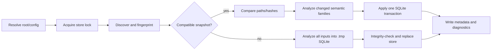

# RimContext static-analysis module architecture

Status: implemented first release (`0.1.0`, schema `rimctx/v1`). RimContext is an internal
RimLiaison module with a typed Core API, a direct drill-down CLI, and its own tests; this document
describes the module and its deliberate v1 limits.

## Purpose and boundaries

RimContext is a deterministic, local index and query CLI for RimWorld mod development. It
precomputes source, XML, Harmony, assembly, mod, project, and dependency facts so an agent can
identify what to inspect without repeatedly opening files or launching RimWorld.

RimContext owns:

- workspace discovery, normalized paths, fingerprints, incremental invalidation, and persisted index
  metadata;
- static C# (Roslyn), XML, managed assembly metadata, project, and `About/About.xml` analysis;
- stable entity IDs and deterministic relationships for definitions, symbols, patches, and dependencies;
- bounded `find`, `refs`, `definition`, `affected`, `harmony`, `file`, and `summary` queries;
- compact JSON, human-readable JSON, concise errors, and stderr diagnostics.

RimContext does not own runtime game control, process lifecycle, readiness, save/debug automation, test
execution, build orchestration, deployment, assembly loading, package restore, MSBuild execution,
network access, UI automation, or live IPC. DevBridge2 remains the lifecycle/test authority and
RimBridgeServer remains the live-game observation/control authority. RimContext has no dependency on
either project and does not launch RimWorld.

RimLiaison uses `RimContext.Core` in-process for normal affected selection. The typed Core API
returns bounded domain results directly, so the normal path does not spawn `rimctx` or serialize a
temporary JSON handoff. The direct `rimctx` executable remains a narrow drill-down/debugging
surface over that same Core API and retains the versioned `rimctx/v1` contract.

## Runtime, layout, and entrypoint

The consolidated solution targets `net8.0`; the root `global.json` pins SDK `8.0.424` with
roll-forward disabled. `src/RimLiaison.Cli` references `RimContext.Core` directly. The separate
`src/RimContext.Cli/Program.cs` delegates to `CliApplication`, whose executable name is `rimctx`,
for direct drill-down callers and CLI contract tests.
The source-tree Windows wrapper `rimctx.cmd` runs the Release executable, falls back to Debug, and
prints a build instruction if neither exists. Build with:

```text
dotnet build RimLiaison.sln --configuration Release
```

The runtime dependencies are deliberately small and pinned by the project files: Roslyn C# 4.11,
Microsoft.Data.Sqlite 8.0.8, and System.Reflection.Metadata 8.0.0. No indexed assembly is loaded into
the RimContext process.

The module's layout inside RimLiaison is:

```text
RimLiaison/
  global.json                 # canonical repository SDK configuration
  RimLiaison.sln              # all internal projects
  Directory.Build.props       # canonical repository build configuration
  rimctx.cmd                   # direct RimContext drill-down wrapper
  rimliaison.cmd               # canonical orchestration wrapper
  src/RimLiaison.Cli/          # orchestration frontend
  src/RimError.*               # diagnostic module and direct drill-down CLI
  src/RimContext.Core/
    Configuration/ Discovery/ Logging/ Model/ Output/ Semantics/ Storage/
  src/RimContext.Cli/
    Program.cs CliApplication.cs CliParser.cs CliRequest.cs
  tests/RimContext.Tests/
    Program.cs
  tests/Fixtures/RealisticMod/
  docs/architecture.md
  docs/agent-usage.md
```

## Direct CLI contract

The following commands are the direct RimContext drill-down surface. The normal agent-facing
entrypoint is `rimliaison affected --run --json`, which uses the Core API in-process before it
coordinates external DevBridge2 work.

The implemented commands are:

```text
rimctx index
rimctx find QUERY
rimctx refs ENTITY
rimctx definition ENTITY_OR_NAME
rimctx affected PATH [PATH ...]
rimctx harmony [TARGET] [--file PATH]
rimctx file PATH_OR_ID
rimctx summary
rimctx version
```

Common options are `--root`, `--store`, `--assembly-root` (repeatable for indexing), `--force`,
`--json`, `--compact`, `--human`, `--limit`, and `--max-bytes`. `refs` accepts `--direction in|out|both`;
`affected` accepts `--depth 1..8`; `find` accepts `--kind`. The parser defaults to compact agent
output. `--json` is accepted for explicit agent command lines; output is JSON for every command.

The default store is `<root>/.rimctx/index.sqlite`. A custom store must not be inside the indexed
root except under `.rimctx`. Paths are canonicalized before discovery and displayed relative to the
workspace with `/` separators. External assembly roots use deterministic `external/<root-key>/...`
display paths.

All successful commands write one JSON object and a newline to stdout. Logging and unexpected
exception diagnostics go to stderr. Queries never scan, build, launch the game, or repair an index.

## Indexing pipeline



1. `WorkspaceConfiguration` canonicalizes the root, store, and assembly roots and computes the
   configuration fingerprint. `WorkspaceDiscovery` walks deterministically, skips `.git`, `.vs`,
   `bin`, `obj`, `artifacts`, `.rimctx`, and reparse-point directories, and includes `.cs`, `.xml`,
   `.csproj`, `.sln`, `Directory.Build.*`, `packages.lock.json`, and `.dll`/`.exe` files. External
   binaries are included only from explicit assembly roots.
2. Each candidate is normalized and fingerprinted with SHA-256, size, and modification ticks.
   Comparison identifies added, changed, metadata-only, removed, and unchanged files. Unchanged
   files are not reparsed.
3. XML, C#, and project/mod analyzers run only for the changed semantic families. They emit compact
   entities, relations, and per-file diagnostics. XML and C# resolution is recomputed when needed so
   deleted or changed definitions and symbols do not leave stale relationships.
4. A first or reset index is written to `<store>.tmp`, then published with the platform's atomic
   replacement path where available. Incremental updates use one SQLite transaction, so an
   interrupted transaction rolls back to the prior readable database.
5. An index lock at `<store>.lock` prevents concurrent writers. Lock contention returns
   `STORE_LOCKED`; there is no hidden wait. A stale `<store>.tmp` is removed at the start of the next
   locked index. A schema mismatch, incompatible metadata, missing snapshot, or SQLite-open/schema
   failure is treated as a stale/corrupt cache and rebuilt by `index`; query commands report the
   store error and do not mutate it.

### Supported semantic subset

- XML records direct Def children, `defName`, `ParentName`, source line, ownership, conservative
  child-value Def references, inheritance, and `PatchOperation` nodes. It does not emulate the full
  RimWorld XML loader or claim uncertain references.
- C# uses Roslyn syntax rather than regular expressions. It records namespaces, classes, structs,
  interfaces, enums, records, nested/partial types, members, inheritance/interfaces, attributes,
  useful type/member usages, visibility, staticness, and source locations. Incomplete source produces
  a diagnostic where possible.
- Harmony recognizes common attributes, constructors, property accessors, overload argument
  declarations, target-method declarations, patch markers, and statically recognizable patch calls.
  Runtime Harmony inspection is intentionally absent; unresolved targets carry resolution/confidence
  metadata.
- Project/mod analysis reads literal project references, package/reference metadata, `About.xml`
  package and load-order metadata, and ownership. It does not execute MSBuild or infer arbitrary
  imported/globbed/generated inputs.
- Managed assemblies are inspected through metadata APIs only. Missing references or malformed files
  produce bounded diagnostics rather than process loading.

## Persistence, schema, and IDs

The SQLite v1 schema contains `meta`, `files`, `entities`, and `relations` tables plus indexes. It
stores schema/tool/workspace/configuration metadata, indexed path/kind/hash/size/mtime/status,
entity payloads, relation payloads, and index timestamp. It intentionally does not contain the
previously proposed `search_terms` or `def_fields` tables; the current query engine loads the compact
records and performs deterministic in-memory matching.

Required first-release entity kinds are:

`source_file`, `csharp_type`, `csharp_member`, `xml_file`, `def`, `def_reference`, `patch_operation`,
`harmony_patch`, `assembly`, `mod`, `project`, and `dependency`.

Relations are directed from dependent/source (`from_id`) to referenced/target (`to_id`) and include
explicit kinds such as `def_reference`, `csharp_type_usage`, `csharp_member_usage`,
`harmony_target`, `harmony_target_member`, `requires`, `load_after`, `load_before`, `incompatible`,
`project_reference`, `assembly_reference`, and `owns`. Unresolved targets retain observed text and
confidence metadata with a null target ID when necessary.

Stable IDs are generated from `kind`, deterministic scope, and canonical semantic identity using
SHA-256/base32. They do not use database row IDs, timestamps, line numbers, or random values. An
unrelated file changing cannot alter another entity's ID. Path identity uses slash-normalized
segments and invariant case for identity; display paths retain useful case but are root-relative.

Schema version is checked through SQLite `user_version` and required metadata. v1 has no in-place
migration. `index` rebuilds an incompatible/corrupt snapshot; a query against an unavailable or
incompatible store returns a structured error.

## Query pipeline and bounded output

The CLI opens the selected store read-only, validates metadata, constructs `SemanticQueryEngine`,
resolves exact IDs/names before fuzzy matching, projects only the query-specific fields, applies
stable ordering and the requested limit, and serializes one envelope. `affected` normalizes and
deduplicates changed paths, returns direct/dependent/runtime-risk tiers, reverse-traverses relations
with depth/node bounds and cycle protection, and marks truncation. Harmony target relations are
classified as runtime risk. No query returns complete source, XML, method bodies, or an unbounded
dependency graph.

Compact JSON omits null fields, empty arrays, and redundant `qualifiedName` values. Query envelopes
include `schemaVersion`, `status`, `command`, optional `results`/`data`, and optional `meta` with
returned count and `truncated`. `--max-bytes` deterministically trims lower-priority arrays and
marks truncation; if the envelope still cannot fit, it returns a minimal `OUTPUT_LIMIT` response.
`--human` emits indented JSON and is intended for people, not agent parsing. Errors are top-level and
concise:

```json
{
  "status": "error",
  "code": "NOT_FOUND",
  "message": "ThingDef/MyWeapon not found"
}
```

No stack traces, absolute workspace paths, raw files, or unrelated suggestions are emitted in normal
JSON. Exit codes are stable: invalid input/limits/ambiguity `2`; index unavailable or incompatible
`3`; not-found/path/input/lock/store errors `4`; failed index publication `5`; reserved command
`not_implemented` `6`; unexpected internal failure `10`.

## Performance and reliability goals

The test suite measures actual fixture timings and output sizes; those measurements are not promises
for every machine. The design goals are: no-op indexing performs no semantic parsing, changed files
invalidate only their semantic families and dependent resolution, queries remain bounded by `--limit`
and `--max-bytes`, and deterministic output does not depend on SQLite row order or input enumeration.
The store lock, SQLite transaction, temporary-store cleanup, compatibility checks, and malformed-input
diagnostics provide recovery across normal interruption and stale-cache conditions. Filesystem access
failures remain fatal and are reported without pretending the index is complete.

## Test strategy

`tests/RimContext.Tests` is an offline `net8.0` executable with deterministic assertions and no
RimWorld, build, network, or live-server dependency. It covers CLI/error/stdout contracts, schema
creation/reopening/version handling, stable IDs, discovery/path exclusions, incremental add/change/
delete/rename behavior, malformed XML/C#, Harmony and dependency semantics, affected traversal, compact
output, output limits, and representative warm queries.

The checked-in `tests/Fixtures/RealisticMod` fixture adds a realistic mod tree with `About.xml`, two
projects and a project reference, several Defs and cross-Def references, C# source, and a Harmony
patch. The production workflow test exercises clean index, summary, exact Def and symbol queries,
refs, Harmony, affected, no-op index, one-file change, repeated affected, XML deletion, and cleanup.
Recovery tests cover stale temporary stores, corrupt SQLite content, schema-version mismatch, and
writer lock contention. The suite reports measured index/query timings, JSON byte counts, and database
size rather than hard-coding performance claims.

## Known implementation limits

- There is no Git-diff or stdin changed-path input for `affected`.
- Semantic resolution is static and conservative; unavailable RimWorld/reference assemblies can
  leave Harmony, C#, or dependency targets unresolved.
- Project evaluation is not MSBuild evaluation, so imports/globs/generated files may be incomplete.
- The v1 schema has rebuild-on-incompatibility rather than migration, and corruption recovery requires
  a writable index command.
- Query matching and projections are deterministic but currently materialize compact entity/relation
  records in memory; very large workspaces may need a later SQL/search-index optimization.
